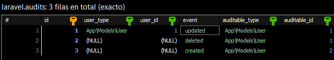

https://laravel.com/docs/11.x/releases
- composer create-project laravel/laravel:^11.0 NameProject
- config bdd DB_CONNECTION=mysql .env

https://laravel.com/docs/11.x/starter-kits
- composer require laravel/breeze --dev / Livewire / Pest
- php artisan breeze:install
- php artisan migrate
- npm install
- npm run build

https://laravel-auditing.com/
- composer require owen-it/laravel-auditing
- php artisan vendor:publish --provider "OwenIt\Auditing\AuditingServiceProvider" --tag="config"
- php artisan vendor:publish --provider "OwenIt\Auditing\AuditingServiceProvider" --tag="migrations"
- php artisan migrate

Example:  
